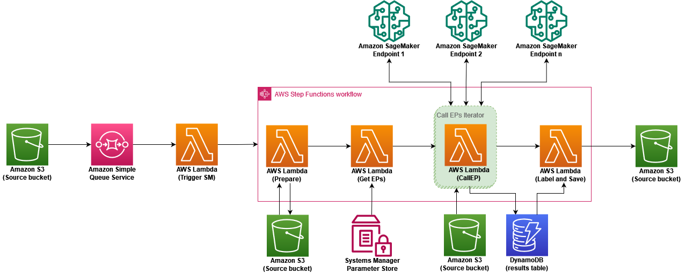

# Analyzing Remote Communications Infrastructure with Computer Vision

This solution shows how to leverage ML tools to analyze on-the-ground or drone-based photographs. Images uploaded to an Amazon Simple Storage Service (Amazon S3) bucket are automatically analyzed by a customizable number of computer vision models. The results are inserted into an Amazon DynamoDB table and used to label the image with bounding boxes, confidence scores, and label name. Finally, a labeled version of the image is uploaded to the S3 bucket.

## Try it yourself

To use this solution, an AWS account with access and permissions to deploy the following services is necessary:

- [SageMaker](https://aws.amazon.com/sagemaker/)
- [Lambda](https://aws.amazon.com/lambda/)
- [Amazon S3](https://aws.amazon.com/pm/serv-s3/?trk=fecf68c9-3874-4ae2-a7ed-72b6d19c8034&sc_channel=ps&s_kwcid=AL!4422!3!536452728638!e!!g!!amazon%20s3&ef_id=Cj0KCQjwtsCgBhDEARIsAE7RYh25D528BtMo_7MQlSCwtPFC4DtwRLsz9GenfDC5MDUzm-7uTo8WhCoaAvZREALw_wcB:G:s&s_kwcid=AL!4422!3!536452728638!e!!g!!amazon%20s3)
- [Amazon SQS](https://aws.amazon.com/pm/sqs/?ef_id=Cj0KCQjwtsCgBhDEARIsAE7RYh0IbDqCZT4jCFP-Idwaw4ti8WokbNIXkEoD4DN-MjZopamKrGrUpvsaAgXLEALw_wcB:G:s&s_kwcid=AL!4422!3!629393325349!!!g!!)
- [AWS Step Functions](https://aws.amazon.com/pm/step-functions/?ef_id=Cj0KCQjwtsCgBhDEARIsAE7RYh0zwE36wNL1-fH5Xyq654Ry5WgnNLDdBiOENFE6GSstODD14hReP6UaArV8EALw_wcB:G:s&s_kwcid=AL!4422!3!629393325319!!!g!!)
- [DynamoDB](https://aws.amazon.com/dynamodb/?trk=94bf4df1-96e1-4046-a020-b07a2be0d712&sc_channel=ps&s_kwcid=AL!4422!3!610000101513!e!!g!!dynamodb&ef_id=Cj0KCQjwtsCgBhDEARIsAE7RYh36RyGA0XaORfnQZ3YEeWHeX6slwdXwLAPSk1hy3qBVuuKjI_MZwAEaAkMtEALw_wcB:G:s&s_kwcid=AL!4422!3!610000101513!e!!g!!dynamodb)
- [Systems Manager](https://aws.amazon.com/systems-manager/?ef_id=Cj0KCQjwtsCgBhDEARIsAE7RYh3HfUyh6jufx52PHvaV69GHdpMnGky_OQYQ0gebq7IJmIrMYTtR7BUaAkxAEALw_wcB:G:s&s_kwcid=AL!4422!3!629393326000!!!g!!) (Parameter Store)
- [AWS CloudFormation](https://aws.amazon.com/cloudformation/)

### Before you begin

We provide all the necessary code for the functions and layers, and a CloudFormation template that deploys all the required resources for you. This architecture is built around an existing, running endpoint model, so we provide the instructions and resources to launch a sample one before deploying the CloudFormation stack.

If you already have available endpoints, then you may skip ahead to the CloudFormation step. However, since different models differ in their expected inputs and outputs, remember that you probably need to change the code in the functions to fit the input format and parameters of your own endpoints.

### Prepare a bucket with all the provided files

Before deploying the resources, we upload all the source files to an S3 bucket so it is easy to find. You must give it a unique name, but throughout the instructions we refer to this bucket as our resource bucket.

You should have the following files:

- `template.yaml`: the CloudFormation template
- `deploy_sample_endpoint.ipynb`: a Jupyter notebook to deploy an the endpoint. You will need a `model.tar.gz`: the parameters for our trained model so we don’t need to train one
- `model.tar.gz`: the parameters for our trained model so we don’t need to train one
- Five Lambda functions
  - `triggerStateMachine.zip`
  - `prepare.zip`
  - `getEndpoints.zip`
  - `callEndpoint.zip`
  - `labelAndSave.zip`
- Three Lambda layers. You will need to [create three layers](https://docs.aws.amazon.com/lambda/latest/dg/creating-deleting-layers.html#layers-create) for the following libraries: [fonts](https://pypi.org/project/fonts/), [pillow](https://pypi.org/project/pillow/), and [opencv-headless](https://pypi.org/project/opencv-python-headless/). Make sure to use the following names:
  - `FontLayer.zip`
  - `OpenCVHeadlessLayer.zip`
  - `PillowLayer.zip`
- `TestImage.zip`: A folder with some images to test the architecture

1. **Create an S3 bucket**

   - Navigate to Amazon S3, select buckets, and select **Create bucket**.
   - Name it anything you want (must be globally unique). For example, resources-XXXX-XXXX-XXXX using your account number.
   - Leave all the other parameters as default.
   - Select **Create bucket**.

2. **Upload all the provided documents to your resources bucket**
   - Once your bucket is deployed, navigate to it and select **Upload**.
   - Drag all the provided files of select **Add** files and locate them locally.
     - NOTE: The files should NOT be in a folder. They should be uploaded as a “flat” hierarchy.
   - Leave everything else as default and select **Upload**. The larger files may take a minute or two to upload depending on your internet connection.

### Deploy the object detection sample endpoint with SageMaker

For our sample model, we deploy an already trained model to recognize bees from images.

1. **Provision a SageMaker Notebook Instance**
   - From your [AWS Management Console](https://aws.amazon.com/console/), navigate to **SageMaker**.
   - In the left panel go to **Notebook > Notebook Instances**.
   - Select **Create notebook instance** in the top-right corner.
   - In Notebook instance settings
     - Name your instance (e.g., _sample-endpoint_).
     - Leave the instance type and platform identifiers as default.
   - In Permissions and encryption
     - Select **Create a new role** in the dropdown and then **Any S3 bucket** in the popup window. Select Create role.
     - Leave the other fields as default.
   - Leave all the optional sections as default and select **Create notebook instance**.
   - Wait 2-3 minutes for the notebook’s status to go from Pending to InService, then select **Open JupyterLab**.
2. **Run the provided notebook**
   - Inside JupyterLab, select the _upload files_ icon. It is the upward-pointing arrow at the top of the left panel.
   - Locate the _deploy_sample_endpoint.ipynb_ in your local machine and open it. Once it appears in the left panel, double-click the file to open the notebook.
   - From the dropdown, select **conda_tensorflow2_p310** for the Kernel and select **Select**.
   - Note that you need to copy the Amazon S3 URI of the _model.tar.gz_ that you uploaded earlier and paste it into the model_artifact line in the second cell.
   - Run the first four cells of notebook but do not run the last cell so you DON’T DELETE THE ENDPOINT.
     - Note that, depending on your [AWS Region](https://aws.amazon.com/about-aws/global-infrastructure/regions_az/), the ml.m5.xlarge instance may not be available. If that's the case and you get an error, then try a similar instance. For example, ml.g5.2xlarge.
   - Back in the Console, navigate back to SageMaker and in the left panel select **Inference > Endpoints** to see the endpoint being deployed. Wait until the endpoint status goes from Creating to _InService_.
   - Copy the _Name_ (not the ARN) of the endpoint and save it somewhere or continue the next steps on a separate window so you have the name available.

### Launch the CloudFormation template to deploy the architecture

1. In the Console, navigate to CloudFormation.
2. Select **Create stack**.
3. Select **Template is ready** and for the source choose **Amazon S3 URL**.
4. Locate the _template.yaml_ file in the resources bucket and copy its URL (not the URI), then paste it into the Amazon S3 URL field.
5. Select **Next**.
6. In _Specify stack details_
   - Provide a name for your stack, such as _ComputerVisionStack_.
   - **EndpointConfigValue**: Paste your endpoint name inside the appropriate place in the EndpointConfigValue parameter. It looks like this:
     {… "ep_name": "tf2-object-detection-xxxx-xx-xx-xx-xx-xx-xxx"…}
   - **ResourcesPublicBucketName**: This is the name of your resource bucket. Update it.
   - **SourceBucketName**: This is the name of the source bucket that CloudFormation creates, so it must be a unique name. We upload the images that we want labeled to this bucket.
   - **TableName**: The name for the DynamoDB table for the model results. You can leave the default name or provide another one.
7. Select **Next**.
8. For stack options, leave everything default and select **Next**.
9. In Review, acknowledge and select **Submit**.
10. Wait until the stack creates.

### Test the solution

1. Navigate to Amazon S3.
2. Find and navigate to the newly created source bucket. It is the source bucket you named in the previous step.
3. Select **Create folder** and call it _raw_images_.
4. Select **Create folder**.
5. In the _raw_images_ folder, upload one of the test images (or multiple if you prefer). After a few seconds, you should see two folders created in the bucket: _resized_images/_ and _labeled_images/_ with the corresponding results inside.
6. You can examine the endpoint output in the results table by navigating to _DynamoDB > Tables > Explore items_ and selecting the results table.
7. You can examine the state of the state machine by navigating to _Step Functions > State machines > ComputerVisionOrchestrator_.

Don’t forget to [delete the stack](https://docs.aws.amazon.com/AWSCloudFormation/latest/UserGuide/cfn-console-delete-stack.html) and SageMaker resources after you are done so that you don’t incur unwanted charges. For SageMaker you just need to finish running the last cell to delete the endpoint and then delete the notebook instance.

Congratulations on deploying the solution!
